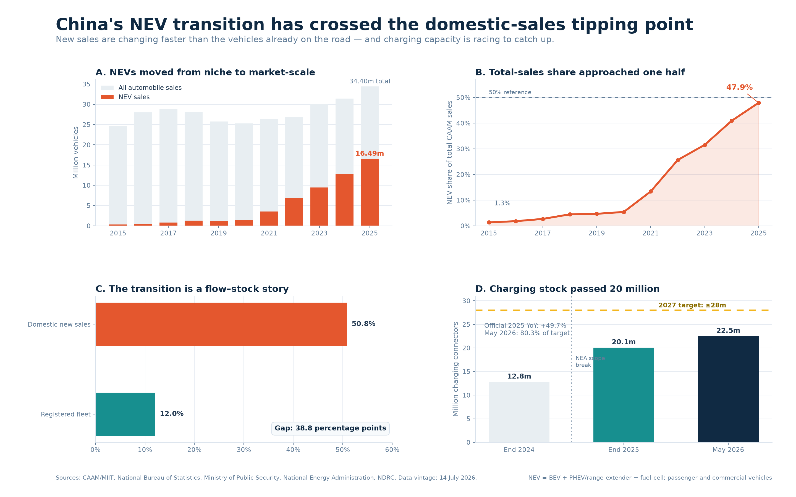

# Past the Tipping Point, Not Yet Transformed

**China's NEV sales, fleet, charging, powertrain, and export transition, 2015-2026**



China's new-energy vehicle transition has crossed the domestic new-sales
tipping point, but it has not yet transformed the vehicles already on the road.
In 2025, NEVs were **50.8% of domestic new-vehicle sales** and only **12.0% of
the registered automobile fleet**. That 38.8 percentage-point flow-stock gap is
the project's central story.

## Course submission

This repository is the complete SUM26001 final-project submission.

- **Final report PDF:** [final_report.pdf](final_report.pdf)
- **QMD that generates the PDF:** [final_report.qmd](final_report.qmd)
- **Published research website:** [China NEV Transition](https://hyang9689-hash.github.io/china-nev-transition/)
- **Website report source:** [index.qmd](index.qmd)
- **Executed notebook:** [notebooks/01_exploration.ipynb](notebooks/01_exploration.ipynb)
- **Bibliography:** [references.bib](references.bib)
- **Source audit trail:** [data/manual/source_register.csv](data/manual/source_register.csv)

To regenerate the course PDF from the repository root:

```bash
quarto render final_report.qmd --output final_report.pdf
```

## Member and contribution

| Member | Student ID | Contribution |
|---|---|---|
| Yang Haoyuan (杨皓元) | 202320108112 | Sole project member. Completed the research design, source collection, data transcription and independent verification, provenance archive, data dictionary, Python analysis, visualizations, powertrain/export extension, scenarios, fleet-turnover model, tests, notebook, Quarto reports, Git history, CI workflow, repository publication, and GitHub Pages deployment. |

This is a one-member project. No teammate contribution or merge history is
claimed. The commit history documents individual iteration and project
management.

## Problem statement and objectives

The project asks:

> **How quickly are China's rapidly growing NEV sales translating into changes
> in the registered vehicle fleet, charging network, powertrain mix, and export
> market?**

The objectives are to:

1. Build and verify a 2015-2025 annual automobile and NEV sales series.
2. Separate new-sales flow from registered-fleet stock.
3. Evaluate charging growth without hiding the 2025 methodology break.
4. Analyze BEV, PHEV/range-extender, FCEV, and export composition.
5. Construct bounded sales-share sensitivities to 2030 and fleet-turnover
   sensitivities to 2035.
6. Preserve a reproducible chain from source evidence to published claims.

The work is descriptive and scenario-based. It does not claim that charging
construction caused adoption.

## Progress made

The project began as a proposed campus survey about student car culture and
preferences. Survey recruitment, consent, anonymization, and sample-size risk
made that design difficult to complete credibly within the course schedule. The
scope was therefore changed to a national public-data study with an auditable
research question.

The completed project now includes:

- A verified annual market series and current 2026 pulse kept in separate scopes.
- Independent double-entry checks for older manually transcribed values.
- Eighteen archived source captures with SHA-256 checksums.
- A machine-readable data dictionary and cross-file schema validation.
- BEV/PHEV/FCEV composition and automobile/NEV export analysis.
- Bounded 2030 sales-share sensitivities with a held-out form check.
- A tested fleet-turnover model through 2035.
- An executed Python notebook, four publication figures, and a cited report.
- A locked Python environment, pinned Quarto 1.9.38 renderer, deterministic
  notebook outputs, 20 automated tests, GitHub Actions, and Pages.
- A root QMD and PDF prepared specifically for the course submission format.

## Main results

- NEV sales grew from 0.331 million in 2015 to 16.490 million in 2025: a
  **47.8% compound annual growth rate**.
- The NEV share of total CAAM automobile sales rose from 1.3% to 47.9%.
- The 2025 domestic new-sales share was 50.8%, versus a 12.0% registered-fleet
  share: a **38.8 percentage-point flow-stock gap**.
- NEVs produced **122.3% of total net market growth in 2025** because estimated
  non-NEV sales fell by 0.66 million vehicles.
- China had 20.092 million charging connectors at end-2025; 76.5% were private.
- By May 2026, 22.497 million connectors equaled 80.3% of the official end-2027
  target of at least 28 million.
- PHEV/range-extender share of NEV deliveries rose from 18.4% in 2020 to 40.0%
  in 2024.
- NEVs reached 36.8% of automobile exports in 2025.
- The fleet-turnover sensitivities place the 2035 NEV fleet share between 50.2%
  and 63.3%; the bounded sales-share backtest has a 5.34-point MAE.

These claims, formulas, and definition limits are documented in the report and
notebook. The 2025 charging methodology break is marked rather than hidden.

## Bottlenecks and accommodations

| Bottleneck | Accommodation or solution |
|---|---|
| Campus survey evidence could not be guaranteed | Changed to a reproducible national public-data study. |
| Older official figures required manual transcription | Added independent double-entry verification and source IDs. |
| Source pages and definitions can change | Archived evidence with retrieval metadata and SHA-256 checksums. |
| Charging scope changed during 2025 | Marked the break and used source-reported growth instead of a false splice. |
| Windows and Linux normalized one text ending differently | Registered canonical Git-blob hashes and enforced LF for evidence snapshots. |
| Aggregate scenarios can be mistaken for forecasts | Used bounded forms, held-out error reporting, explicit assumptions, and limitation labels. |

## Lessons learned

- Definitions and denominators are part of the analysis, not administrative
  details.
- A high new-sales share does not imply an equally transformed vehicle fleet.
- Reproducibility checks catch errors that visual inspection can miss.
- A visible limitation is more credible than an artificially smooth series.
- Models are most useful when assumptions and accounting identities are open.
- Focused Git commits make the research process easier to audit and explain.

## Repository map

```text
china-nev-transition/
|-- README.md                         # Project and course-submission entry point
|-- final_report.qmd                  # QMD source for the course PDF
|-- final_report.pdf                  # Final course report
|-- index.qmd                         # Cited website report
|-- references.bib                    # BibTeX references
|-- _quarto.yml                       # Website configuration
|-- notebooks/
|   `-- 01_exploration.ipynb          # Executed Python analysis
|-- data/
|   |-- README.md                     # Definition and provenance rules
|   |-- manual/source_register.csv    # Source metadata
|   |-- raw/                          # Archived evidence and checksums
|   `-- processed/                    # Inputs and code-derived outputs
|-- src/                              # Tested analytical functions
|-- scripts/                          # Build, notebook, and validation commands
|-- tests/                            # Unit, schema, and model tests
|-- figures/                          # Rebuilt analysis figures
|-- docs/                             # Rendered GitHub Pages site
|-- notes/research-log.md             # Dated analytical decisions
`-- .github/workflows/publish.yml     # Test and Pages publication workflow
```

## Reproduce locally

Python 3.12 and Quarto 1.9.38 are the reference tools. The canonical Python
environment is `pyproject.toml` plus `uv.lock`; `requirements.txt` remains a
compatibility list for tools that only support pip.

On Windows, install uv and run:

```powershell
.\scripts\bootstrap.ps1
```

The bootstrap creates the locked `.venv` and verifies pandas, NumPy,
Matplotlib, and the notebook libraries. No manual activation is required.

For a complete rebuild and verification:

```powershell
.\scripts\rebuild.ps1
```

The equivalent cross-platform sequence is:

```bash
uv sync --frozen --python 3.12
uv run --frozen python scripts/build_analysis.py
uv run --frozen python scripts/build_notebook.py
uv run --frozen python -m nbconvert --to notebook --execute --inplace notebooks/01_exploration.ipynb --ExecutePreprocessor.timeout=120 --ExecutePreprocessor.record_timing=False
uv run --frozen python -m unittest discover -s tests -v
quarto render
quarto render final_report.qmd --output final_report.pdf
uv run --frozen python scripts/validate_project.py
```

Use `python -m nbconvert` inside the locked environment. A global Jupyter
installation can select the wrong kernel and miss project packages.

## Data discipline

- Sales, production, exports, registrations, and fleet stock remain separate.
- Total-sales share and domestic-sales share remain separate.
- NEV and internationally defined electric passenger cars remain separate.
- Charging connectors and charging stations remain separate.
- Reported observations and calculated indicators remain separate.
- The revised NEA charging series is not silently spliced to the old scope.

Read [data/README.md](data/README.md) before adding or changing a value.

## Git history

The repository was built through focused commits rather than one final file
dump. Inspect the complete trace with:

```bash
git log --oneline --decorate --graph --all
```

Commit subjects use `chore`, `docs`, `data`, `analysis`, `test`, `ci`, `fix`, and
`release` prefixes. Important milestone commits are summarized in the final PDF
and [PUBLICATION_LOG.md](PUBLICATION_LOG.md).

## Publication

- **Repository:** [hyang9689-hash/china-nev-transition](https://github.com/hyang9689-hash/china-nev-transition)
- **Website:** [hyang9689-hash.github.io/china-nev-transition](https://hyang9689-hash.github.io/china-nev-transition/)

GitHub Actions rebuilds the analysis and notebook, runs the full test suite,
renders Quarto, validates artifacts, and deploys GitHub Pages.

## License and citation

Code is released under the MIT License. Source data retain their original terms
and attribution. Citation metadata identify Yang Haoyuan, version 1.0.0, and
the canonical repository/site URLs in [CITATION.cff](CITATION.cff).
