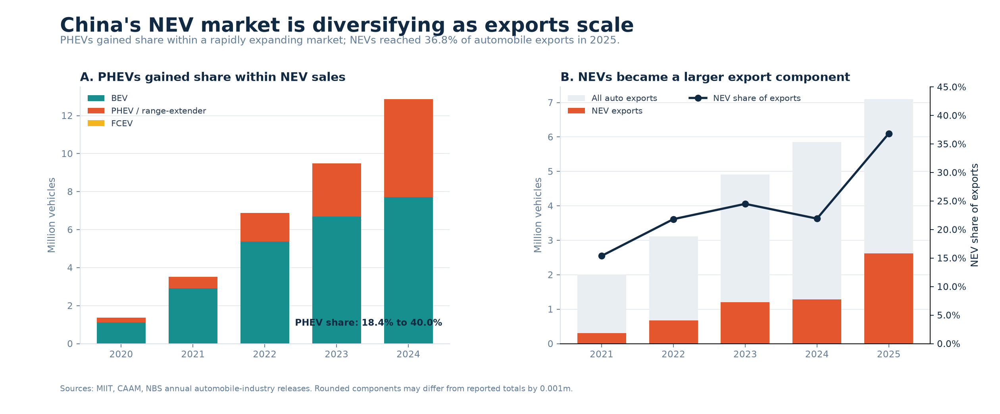
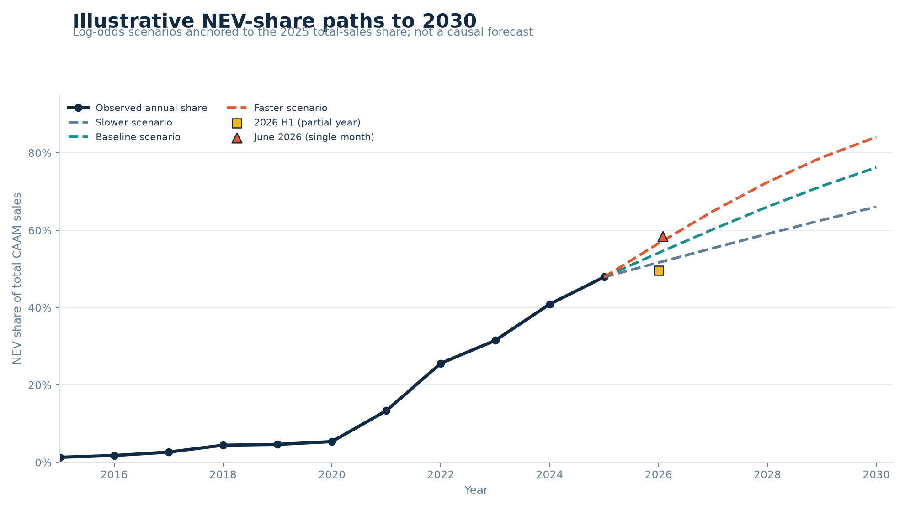
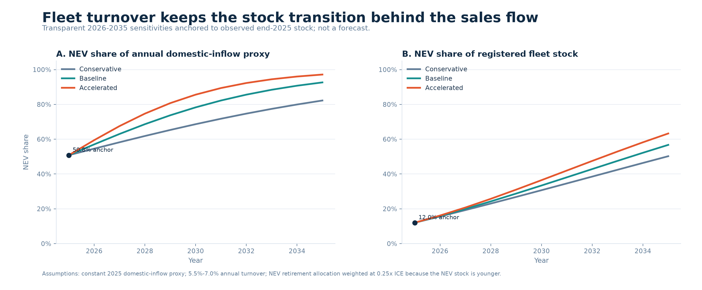

::: {.callout-important appearance="simple"}
## The argument in one sentence

China's automobile transition has crossed the **domestic new-sales** tipping
point, but it has not yet transformed the **vehicles already on the road**.
:::

::: {.grid}
::: {.g-col-6 .g-col-md-3}
::: {.metric-card}
<span class="metric-value">50.8%</span>
<span class="metric-label">NEV share of domestic new-vehicle sales in 2025</span>
:::
:::
::: {.g-col-6 .g-col-md-3}
::: {.metric-card .teal}
<span class="metric-value">12.0%</span>
<span class="metric-label">NEV share of the registered automobile fleet at end-2025</span>
:::
:::
::: {.g-col-6 .g-col-md-3}
::: {.metric-card .navy}
<span class="metric-value">20.1m</span>
<span class="metric-label">Charging connectors installed at end-2025</span>
:::
:::
::: {.g-col-6 .g-col-md-3}
::: {.metric-card .gold}
<span class="metric-value">47.8%</span>
<span class="metric-label">Compound annual growth of NEV sales, 2015–2025</span>
:::
:::
:::

The first two numbers deliberately use different denominators: one is a flow
of new domestic sales and the other is a stock of registered automobiles. Their
**38.8 percentage-point gap** is the project's main empirical story. The 50.8%
domestic share is source-reported; dividing total CAAM NEV sales by total CAAM
automobile sales gives a separate 47.9% share [@scio2026tipping; @miit2026auto].

# Research question

**How quickly is China's dominance of new-energy vehicles in new-vehicle sales
translating into the on-road fleet, and has charging infrastructure kept pace?**

Three subquestions make this answerable:

1. How did annual NEV sales and their share of the total automobile market
   change from 2015 to 2025?
2. How large is the gap between the new-sales flow and the registered-fleet
   stock, and what does it mean?
3. How quickly is charging capacity expanding, and how close is the connector
   stock to the official 2027 target?
4. How are powertrain composition and exports changing the shape and geographic
   destination of NEV industry deliveries?

# Evidence at a glance

{#fig-dashboard fig-alt="Dashboard showing NEV sales growing from 0.33 million in 2015 to 16.49 million in 2025, total-sales share rising to 47.9 percent, domestic new-sales share at 50.8 percent versus fleet share at 12 percent, and charging connectors rising to 22.5 million by May 2026." width="100%"}

# Data and method

The annual market series combines CAAM's historical charts and December
statistical releases with official 2024 and 2025 summaries
[@caam2021autoseries; @caam2021nevseries; @caam2022autosales;
@caam2022nevsales; @caam2023autosales; @caam2023nevsales;
@caam2024autosales; @caam2024nevsales; @gov2025auto; @miit2026auto].
Fleet observations come from national statistical and public-security reporting
[@nbs2025communique; @nbs2026communique; @mps2026fleet]. Charging observations
and the 2027 target come from the National Energy Administration and National
Development and Reform Commission [@nea2025charging; @nea2026charging;
@nea2026may; @ndrc2025target].

The core mathematics is intentionally basic and inspectable:

$$
\text{NEV share}_t =
\frac{\text{NEV sales}_t}{\text{total automobile sales}_t}\times 100
$$

$$
\text{YoY growth}_t =
\left(\frac{x_t}{x_{t-1}}-1\right)\times 100
$$

$$
\text{CAGR} =
\left(\frac{x_{end}}{x_{start}}\right)^{1/n}-1
$$

All derived indicators are rebuilt by `scripts/build_analysis.py`; the executed
notebook shows the arithmetic and its outputs.

::: {.definition-note}
**Definition discipline.** “NEV” includes battery-electric, plug-in hybrid
(including range-extender), and fuel-cell passenger and commercial vehicles.
CAAM sales are not retail registrations; connectors are not charging stations;
and partial-year observations are never appended to the complete annual series.
:::

# Findings

## 1. The market changed scale after 2020

NEV sales rose from **0.331 million in 2015** to **16.490 million in 2025**,
equivalent to a **47.8% ten-year CAGR**. Total automobile sales did not grow at
anything close to that rate. As a result, the NEV share of total CAAM sales rose
from **1.3%** to **47.9%**.

| Year | Total auto sales (m) | NEV sales (m) | Derived NEV share |
|---:|---:|---:|---:|
| 2015 | 24.60 | 0.33 | 1.3% |
| 2020 | 25.31 | 1.37 | 5.4% |
| 2021 | 26.28 | 3.52 | 13.4% |
| 2023 | 30.09 | 9.50 | 31.6% |
| 2024 | 31.44 | 12.87 | 40.9% |
| 2025 | 34.40 | 16.49 | 47.9% |

The composition of growth is even more revealing. From 2024 to 2025, total
automobile sales increased by **2.964 million**, while NEV sales increased by
**3.624 million**. NEVs therefore accounted for **122.3% of net market growth**;
the residual estimate for non-NEV sales fell by **0.660 million**. A contribution
above 100% is mathematically possible because another component contracted.

## 2. Crossing 50% in sales does not mean half the fleet is electric

At end-2025, China had **43.97 million NEVs** in a civilian automobile stock of
**366.11 million**, or approximately **12.0%** [@nbs2026communique]. Public-
security reporting gives the same 12.01% share and records 30.22 million BEVs,
68.74% of the NEV fleet [@mps2026fleet].

This resolves an apparent paradox. New sales can change quickly, but the fleet
turns over slowly. The sales figure is a flow over one year; the fleet figure is
the accumulation of many years of registrations, retirements, and vehicle
lifetimes. The gap is not evidence of inconsistent data. It is the transition.

## 3. Charging growth is rapid, but the series has a documented break

The NEA reported **20.092 million connectors** at end-2025: 4.717 million public
and 15.375 million private. Private connectors were therefore **76.5%** of the
network. The stock implied **2.19 registered NEVs per connector**, or **9.32 per
public connector** [@nea2026charging].

The agency reported 49.7% year-on-year connector growth in 2025. However, it
also changed the statistical scope and introduced a new national reporting
system during 2025 [@nea2025method]. This report therefore **does not** calculate
a growth rate by dividing the old-scope end-2024 level by the revised-scope
end-2025 level. The dashboard marks the break visibly.

By end-May 2026, the network had reached **22.497 million connectors**, including
4.951 million public and 17.546 million private connectors [@nea2026may]. That
was already **80.3%** of the official end-2027 target of at least 28 million.
Moving from the end-2025 level to 28 million in two years requires roughly
**18.1% annual compound growth** [@ndrc2025target].

## 4. The latest pulse is strong but not an annual observation

In the first half of 2026, CAAM reported **7.446 million NEV sales**. The H1 NEV
share of total CAAM sales was 49.6%, while the single-month June share reached
58.5% [@gov2026h1; @miit2026june]. Those numbers are current context, not an
extra point on the 2015–2025 annual series.

## 5. PHEVs changed the mix while exports changed the destination

{#fig-powertrain-exports fig-alt="Two-panel chart. The first shows BEV deliveries rising from 1.115 million in 2020 to 7.719 million in 2024 while PHEV deliveries rise from 0.251 million to 5.141 million. The second shows total automobile exports rising from 2.015 million in 2021 to 7.098 million in 2025 and NEV exports from 0.310 million to 2.615 million." width="100%"}

The market did not expand with a fixed powertrain mix. Between 2020 and 2024,
reported BEV deliveries rose from **1.115 million to 7.719 million**, while
PHEV/range-extender deliveries rose from **0.251 million to 5.141 million**.
The PHEV share of reported NEV deliveries consequently increased from **18.4%**
to **40.0%** [@miit2021composition; @caam2022nevsales; @caam2023nevsales;
@caam2024nevsales; @nbs2024industry]. Component sums reconcile to reported
annual NEV totals within 0.001 million; the small differences reflect published
rounding.

Exports also became material to interpretation of the industry-delivery series.
Total automobile exports increased from **2.015 million in 2021** to **7.098
million in 2025**, while NEV exports rose from **0.310 million to 2.615
million**. NEVs therefore grew from **15.4% to 36.8% of automobile exports**, and
total exports rose from **7.7% to 20.6% of CAAM industry deliveries**
[@miit2022exports; @miit2023exports; @miit2024exports; @miit2025exports;
@caam2026exports].

Subtracting enterprise-reported exports from industry deliveries gives a 2025
non-export residual NEV share of **50.8%**, which closely matches the separately
reported domestic new-vehicle share. This is a useful cross-check, not a
replacement for the official domestic series: enterprise export reporting,
industry deliveries, domestic retail sales, and customs declarations are
different statistical systems.

# Scenarios to 2030

{#fig-scenarios fig-alt="Line chart showing observed NEV total-sales share rising to 47.9 percent in 2025 and three illustrative scenario paths reaching about 67, 76, and 84 percent by 2030, with separate 2026 partial-period markers." width="90%"}

A straight-line share projection can exceed 100%, so the scenario works in
log-odds space:

$$
\operatorname{logit}(p_{t+h}) = \operatorname{logit}(p_t) + hg
$$

The three values of $g$ (0.15, 0.25, and 0.35) are explicit sensitivities,
anchored to the observed 2025 total-sales share. They imply 2030 shares of about
67%, 76%, and 84%. These are **illustrations, not probabilities or causal
forecasts**.

As a limited form check, a log-odds trend fitted only to 2015-2022 data was
tested on 2023-2025. It underpredicted all three held-out observations, with
absolute errors of 6.0, 6.5, and 3.5 percentage points and a **5.34
percentage-point mean absolute error**. The backtest shows that even a bounded
functional form can miss acceleration; it does not turn the sensitivity paths
into validated forecasts.

# Fleet-turnover sensitivities to 2035

{#fig-fleet-turnover fig-alt="The annual NEV inflow share rises rapidly across conservative, baseline, and accelerated sensitivities, while the registered fleet share follows more slowly. In 2035, the modeled fleet shares are about 50, 57, and 63 percent." width="100%"}

The model begins with the observed end-2025 stock of **43.97 million NEVs in
366.11 million automobiles** and the 2025 non-export residual proxy of **27.302
million vehicle inflows**, 50.8% of them NEVs. Each scenario then applies the
same auditable accounting identity:

$$
	ext{ending stock}
=
	ext{opening stock}
+
	ext{inflow}
-
	ext{retirements}
$$

The annual domestic-inflow volume is held constant to isolate turnover and
composition. Conservative, baseline, and accelerated bundles use annual total
fleet-turnover rates of **5.5%, 6.0%, and 7.0%**, paired with the same 0.15,
0.25, and 0.35 log-odds gains used in the sales-share sensitivities. Because
China's registered NEV stock is comparatively young, an NEV receives **0.25
times** the near-term retirement-allocation weight of a non-NEV. Every rate and
weight is stored in the machine-readable assumptions table, not hidden in the
plotting code.

In the baseline, the NEV share of annual domestic inflow reaches **78.3% in
2030**, but the NEV fleet share reaches only **33.4%**. By 2035 the baseline
figures are **92.6% of inflow and 56.7% of fleet stock**. Across all three
bundles, the 2035 fleet share ranges from **50.2% to 63.3%** and total stock
ranges from **378.5 million to 422.4 million vehicles**.

These results quantify the flow-stock lag under explicit assumptions; they are
not registration forecasts. The model has no vehicle-age cohorts, scrappage
policy shocks, price response, or capacity constraints. Its value is that the
stock-flow identities, anchors, and sensitivity levers are visible and tested.

# What this project does not claim

- It does not claim that charging construction caused NEV adoption.
- It does not mix CAAM sales with passenger-car retail data or registrations.
- It does not treat the 2026 partial-year pulse as a completed year.
- It does not hide the 2025 charging methodology break.
- It does not average conflicting NBS and CAAM production totals.
- It does not present the fleet-turnover sensitivities as registration forecasts.

# Reproducibility

From the repository root, Windows users can run `.scripts
ebuild.ps1`. The
equivalent cross-platform commands are:

```bash
uv sync --frozen --python 3.12
uv run --frozen python scripts/build_analysis.py
uv run --frozen python scripts/build_notebook.py
uv run --frozen python -m nbconvert --to notebook --execute --inplace notebooks/01_exploration.ipynb --ExecutePreprocessor.timeout=120
uv run --frozen python -m unittest discover -s tests -v
quarto render
uv run --frozen python scripts/validate_project.py
```

The source register records publisher, title, date, retrieval date, URL,
coverage, and definition notes. The notebook is committed with executed outputs;
the Quarto source and rendered HTML are both included for inspection.

# Remaining roadmap

1. Build a consistent monthly charging series from June 2025 onward.
2. Replace aggregate turnover sensitivities with age-cohort survival modeling
   when suitable registration cohorts become available.
3. Add destination-level export analysis only if a stable official series can
   be sourced without mixing customs and enterprise-reporting definitions.

# References

